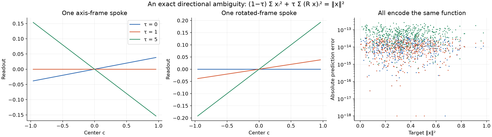

# An interpretable 3D readout, constructed without a solve

September 30, 2026. Codex geometry-unification experiment, questions 4 and 5.

**The higher-dimensional analogue of the 1D derivative readout is real and constructive.** In three dimensions, the canonical tanh readout samples the **third derivative of the plane-integral Radon transform**, with a known correction for finite tanh width. We derived those coefficients directly and evaluated the resulting networks. No training, scalar least-squares conversion, joint least squares, fitted amplitude, or target-dependent geometry selection enters the new test.

The same formula, same center grid, and same angular rules work for an isotropic Gaussian, a rotated anisotropic Gaussian, and a shifted signed mixture. The construction is highly redundant and expensive. Its purpose here is to settle what the coefficients can mean, not to claim a scalable optimizer.

## 1. The object and its normalization

The target is a rapidly decaying smooth function \(f:\mathbb R^3\to\mathbb R\). A direction \(v\) is a unit vector in the sphere \(S^2\), and \(t\in\mathbb R\) is a scalar displacement along that direction. The plane-integral Radon transform is

\[
(Rf)(v,t)=\int_{x\cdot v=t}f(x)\,dS(x).
\]

This is a function of direction and displacement. It is **not** the spatial slice \(f(tv)\). Define the one-dimensional profile

\[
q_v(t)=-\frac{1}{2\pi}\frac{\partial^2}{\partial t^2}(Rf)(v,t).
\]

Then three-dimensional Radon inversion says

\[
f(x)=\frac{1}{4\pi}\int_{S^2}q_v(v\cdot x)\,d\Omega(v).
\tag{1}
\]

The conventional unnormalized formula is \(f=-(8\pi^2)^{-1}\int_{S^2}(Rf)''(v,v\cdot x)d\Omega\); substituting the definition of \(q\) gives (1). This normalization is verified against [Radon inversion, equations 9.A.2–9.A.5](https://www.math.utoronto.ca/courses/apm346h1/20181/PDE-textbook/Chapter9/S9.A.html). The profiles describe a canonical whole-space ridge representation. They do not identify the only possible decomposition on a bounded fitting region.

Choose a spherical quadrature rule with directions \(v_m\) and nonnegative normalized weights \(w_m\), so \(\sum_mw_m=1\). Equation (1) becomes

\[
f(x)\approx\sum_m w_mq_{v_m}(v_m\cdot x).
\tag{2}
\]

The direction approximation and the scalar approximation on each spoke are separate. The experiment measures both.

## 2. From those profiles to individual tanh readouts

Centers \(c_j\) are equally spaced real numbers, separated by \(h\), and \(\gamma>0\) is the common tanh scale. Our network is

\[
\widehat f(x)=b+\sum_{m,j} a_{mj}\tanh\{\gamma(v_m\cdot x-c_j)\}.
\]

The leading QI readout is

\[
a_{mj}^{(0)}=\frac{h w_m}{2}q'_{v_m}(c_j)
=-\frac{h w_m}{4\pi}(Rf)'''(v_m,c_j).
\tag{3}
\]

To see exactly where it comes from, introduce the unit-mass bump

\[
K_\gamma(t)=\frac\gamma2\operatorname{sech}^2(\gamma t).
\]

Replacing the scalar grid sum by an integral, a profile constructed with coefficient density \(\rho\) obeys

\[
\frac{d}{dt}\left[\frac12\int_{\mathbb R}\rho(c)\tanh\{\gamma(t-c)\}\,dc\right]
=\int_{\mathbb R}\rho(c)K_\gamma(t-c)\,dc.
\]

Thus the derivative is \(K_\gamma*\rho\). Setting \(\rho=q'\) gives a smoothed version of \(q'\), not exactly \(q'\). Equation (3) is the leading approximation when that smoothing is small.

With Fourier convention \(\widehat u(\omega)=\int u(t)e^{-i\omega t}dt\), write \(A=\pi/(2\gamma)\). The bump multiplier is

\[
\widehat K_\gamma(\omega)=\frac{A\omega}{\sinh(A\omega)}.
\]

Consequently a prescribed deconvolved density is

\[
\widehat\rho(\omega)=\frac{\sinh(A\omega)}{A\omega}\widehat{q'}(\omega).
\tag{4}
\]

For real analytic profiles with a suitable complex extension, equation (4) has the convenient form

\[
\rho(c)=\frac{q(c+iA)-q(c-iA)}{2iA}
=\frac{\operatorname{Im}q(c+iA)}A.
\tag{5}
\]

Indeed, imaginary translation multiplies a Fourier mode by \(e^{\mp A\omega}\), so the centered difference has multiplier \(i\sinh(A\omega)/A\); dividing by the derivative multiplier \(i\omega\) gives (4). The actual supplied finite-network coefficients are

\[
\boxed{a_{mj}=\frac{h w_m}{2A}\operatorname{Im}q_{v_m}(c_j+iA).}
\tag{6}
\]

The bias matches the prescribed discrete angular sum at the origin:

\[
b=\sum_mw_mq_{v_m}(0)-\sum_{m,j}a_{mj}\tanh(-\gamma c_j).
\]

This is a known integration constant, not a fitted scalar. Equations (4)–(6) remove continuum tanh smoothing. Discrete-grid aliasing, finite center-band truncation, quadrature error, and floating-point error remain. The experiment directly checks those remaining errors. It does not claim (6) is an exact finite cardinal-QI formula for arbitrary functions.

## 3. The analytic family makes the prediction independent

For one Gaussian component, let \(B\) be a symmetric positive definite \(3\times3\) matrix and \(\mu\in\mathbb R^3\) its center:

\[
f(x)=a\exp[-(x-\mu)^TB(x-\mu)].
\]

Define \(s_v=v^TB^{-1}v>0\) and \(y=t-v\cdot\mu\). Integrating over the plane gives

\[
(Rf)(v,t)=\frac{a\pi}{\sqrt{\det B}\sqrt{s_v}}e^{-y^2/s_v}.
\]

Differentiating twice and applying the definition of \(q\) yields

\[
q_v(t)=\frac{a}{\sqrt{\det B}\,s_v^{3/2}}
\left(1-\frac{2y^2}{s_v}\right)e^{-y^2/s_v}.
\]

Its derivative is

\[
q'_v(t)=\frac{a}{\sqrt{\det B}\,s_v^{3/2}}
\left(-\frac{6y}{s_v}+\frac{4y^3}{s_v^2}\right)e^{-y^2/s_v}.
\]

Those explicit formulas supply both the leading and corrected readouts. Mixtures follow by linearity. They are not inferred from the tested network's outputs.

The three cases are: \(B=3I,\mu=0\); a fixed rotation of \(\operatorname{diag}(1.5,3,6)\); and a signed sum of the latter shifted by \((.17,-.11,.09)\), amplitude .8, and \(B=2.2I\) shifted by \((-.19,.15,-.1)\), amplitude −.35. These target formulas and the encoder are fixed before evaluation. They test transfer of the analytic encoding, not learning an unknown target from samples.

## 4. Measurements and cost

All results use float64, \(h=.04\), \(\gamma=6.25\), hence \(\gamma h=.25\), and **201 centers per direction in [−4,4]**. This wide band isolates the mathematical interpretation from halo truncation. The angular rule is Gauss–Legendre in the sphere's height coordinate and uniform trapezoidal quadrature in azimuth; antipodal duplicates are merged. These are weighted quadrature directions, not a claim that every uniformly scattered direction set has the same accuracy.

Evaluation uses 512 independent scrambled Sobol points in [−.6,.6]³. There are no training samples. No settings were fit to these evaluations.

| Directions | Total neurons | Isotropic relative L2 | Anisotropic | Shifted mixture |
|---:|---:|---:|---:|---:|
| 16 | 3,216 | 3.36e−3 | 3.99e−2 | 6.47e−2 |
| 64 | 12,864 | 2.87e−7 | 1.10e−3 | 1.80e−3 |
| 144 | 28,944 | 8.79e−12 | 2.40e−5 | 3.87e−5 |
| 400 | 80,400 | 2.07e−15 | 1.18e−8 | 1.57e−8 |
| 1,024 | 205,824 | 2.26e−15 | 5.28e−14 | 1.23e−13 |
| 2,304 | 463,104 | 4.24e−15 | 6.45e−15 | 8.78e−15 |

At the last rule, the maximum absolute errors are 3.94e−15, 4.86e−15, and 4.01e−15. Replacing the corrected readouts by the leading derivative samples on the same geometry gives relative errors **.293, .356, .326**. The difference between the corrected finite tanh network and its prescribed continuous angular sum is about 2e−15 throughout the angular sweep. Thus angular discretization accounts for the errors above the floor; the width correction explains the large leading-sample error.

The large neuron counts must stay attached to the accuracy claim. This settles a representation question and supplies a predictive canonical readout. It is not evidence that dense 3D constructions beat compact trained networks at a fixed budget. It also uses a known whole-space target formula; general finite samples do not directly provide its plane integrals.

## 5. Why least squares need not return that interpretable readout

The existing 2D experiment had already answered this numerically. Analytic filtered-Radon profiles, converted with separate **1D** solves, reached approximately 2e−15–1e−14 on the multivariate target without a joint 2D fit. A more accurate angular construction fixed the composition target's earlier nearest-direction error. Its 4,096-neuron implementation reached 3.41e−14. For that construction, 99.9913% of the squared coefficient discrepancy from the joint least-squares result lay in the joint solver's discarded singular subspace. The projected readout still differed by a few percent because tiny function differences can be amplified in retained weak directions. Details remain in the [existing forward report](../../../checkpoint_H_highdim/expH05_direction_cliff_2d/spoke_profiles/radon_prediction/forward_check/README.md).

The new experiment adds an exact algebraic example, avoiding any numerical singular-vector argument. Let \(R\) be an orthogonal \(3\times3\) rotation. For every real \(\tau\),

\[
\|x\|^2=(1-\tau)\sum_{k=1}^3x_k^2
+\tau\sum_{k=1}^3(Rx)_k^2.
\tag{7}
\]

There are six fixed ridge directions: the three coordinate axes and the three rotated axes. Their profile amplitudes are \(1-\tau\) and \(\tau\). Each scalar profile is a multiple of \(t^2\), so its QI readout is a multiple of \(hc_j\). For quadratics the imaginary-shift correction equals the leading derivative exactly, since \(\operatorname{Im}(c+iA)^2/A=2c\).

Thus \(\tau\) can reverse signs and make individual coefficient curves arbitrarily large while leaving the continuous function exactly unchanged. With our finite tanh grid, \(\tau=0,1,5\) give relative output errors 3.60e−14, 3.59e−14, and 1.94e−13. The coefficient vector changes by **7.07 times its original norm** between 0 and 5, while the predictions change by 2.21e−13 relative.

This proves that a raw spoke readout cannot universally equal a uniquely determined directional derivative of the target. Different spoke allocations encode the same target even when the directions, widths and centers are fixed. A canonical Radon representation selects one allocation using whole-space decay and inversion conventions. A finite-domain least-squares or trained model may select another.

A meaningful invariant does survive in this example. If \(\alpha_m\) is the amplitude of the quadratic profile on direction \(v_m\), then

\[
Q=\sum_m\alpha_m v_mv_m^T
\]

is a \(3\times3\) matrix and \(f(x)=x^TQx\). Equation (7) changes every \(\alpha_m\) but preserves \(Q=I\). Hence the invariant target information is a tensor assembled from coefficients **and their geometry**, while the individual ridge allocations remain free. This is an exact finite-dimensional example of the equivalence-class object the user proposed, not a proof that every Adam network has a similarly low-complexity decoder.

## 6. What this resolves

- **Q4:** Yes: there is a concrete, independent higher-dimensional derivative interpretation. In 3D tanh it is a finite-width-corrected third derivative of a Radon plane integral. The new experiment predicts complete readouts without a solve and reaches the numerical floor at sufficient angular resolution.
- **Q5 boundary:** A universal unique per-neuron derivative interpretation is false without an allocation convention or identifiable observables. Both exact polynomial identities and the prior numerical experiment demonstrate the ambiguity. This does not invalidate target-derived canonical encodings. It means raw learned readouts require a rule for separating target information from interchangeable allocations.
- **Q5 still not claimed here:** This experiment does not decode an arbitrary trained deep network's raw coefficients. It supplies the correct canonical quantity and a rigorous obstruction any such decoder must respect. The other experiment/theory work must address the learned geometry rather than present this construction as an Adam analysis.

The connection to [Parhi and Nowak's variational spline theory](https://arxiv.org/abs/2105.03361) is that their function spaces measure derivatives in the Radon domain and obtain sparse ridge representations under explicit regularization. That literature supports the relevance of a Radon-domain object; it does not establish that an unregularized Adam solution chooses our canonical allocation.

Reproduce with `OPENBLAS_NUM_THREADS=1 VECLIB_MAXIMUM_THREADS=1 OMP_NUM_THREADS=1 .venv/bin/python experiments/expI04_codex_geometry_unification/radon.py`. The script saves `metrics.json`, `construction.npz`, and both PNG/PDF figures here. Measured total experiment time is about four seconds on this Mac; saved coefficients are large but no sampled feature matrix is formed.
