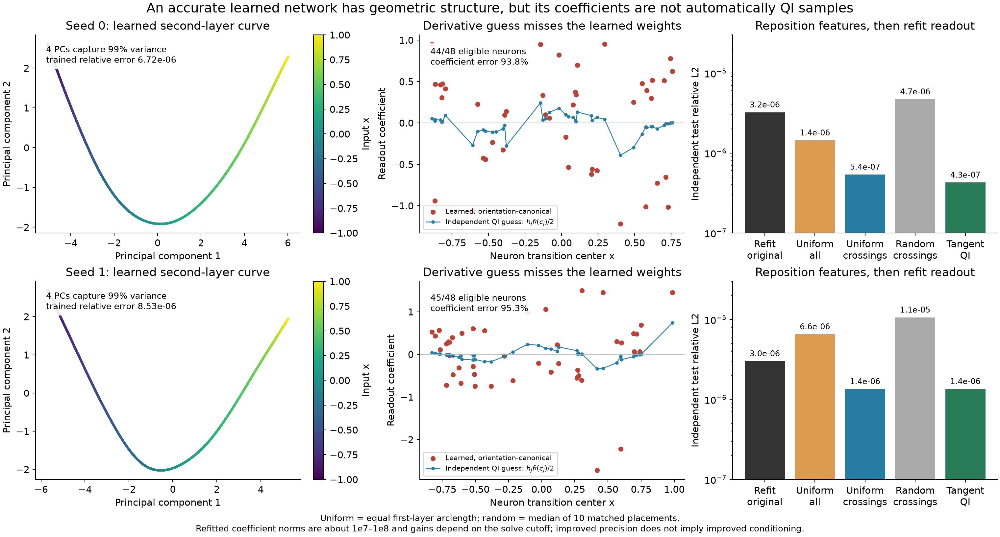
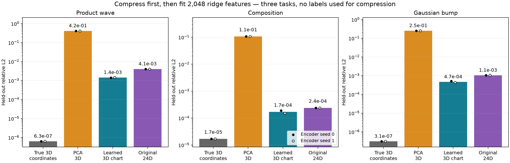
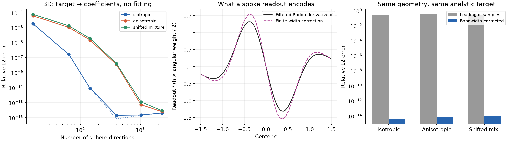

# Codex geometry investigation: measured answers

September 30, 2026. Three delegated investigations plus an independently audited manifold experiment. All compute used the local Mac CPU. This report concerns learned solutions and controlled approximation, not a new optimizer or a proof that arbitrary deep learning works.

## The theory the tests support

A representation partitions inputs into sets that a later readout cannot distinguish. It also changes the coordinates in which approximation is performed. A subsequent nonlinear layer supplies a family of functions in those coordinates. Readouts encode the target in that family, with ambiguities whenever features can replace one another.

This becomes predictive only after specifying which information the representation preserves, what target looks like in its coordinates, and which feature allocations are identifiable. The exact population squared-error decomposition is

\[
\mathbb E[(f(X)-q(g(X)))^2]
=\mathbb E[\operatorname{Var}(f(X)\mid g(X))]
+\|\eta-P_V\eta\|^2
+\|P_V\eta-q\|^2.
\]

Here g maps inputs to latent coordinates; eta(z)=E[f(X)|g(X)=z] is the conditional target; V is the span of the frozen latent features; P_V is its L2 projection under the latent data distribution; q is the current readout function. The terms separate discarded target information, the feature approximation floor, and readout mismatch. The last term can include optimization and finite-sample estimation error; it is not automatically pure optimization error. This is established projection/conditional-expectation theory. The contribution of the campaign is the concrete geometric predictions and checks below.

For a monotone scalar chart z=g(x), define F(z)=f(g^{-1}(z)). Then tanh QI readouts measure F', while ReLU curvature readouts measure F''. Explicitly,

\[
F'(g(x))=f'(x)/g'(x),\qquad
F''(g(x))=f''(x)/g'(x)^2-f'(x)g''(x)/g'(x)^3.
\]

Thus the derivative must be taken in the learned coordinate. Folding can make F cease to be a single-valued function. The [theory report](theory.md) gives spaces, proofs, counterexamples, and all steps of the independent coefficient predictions.

## 1. Ordinary trained second-layer geometry

Two independently initialized 1→48→48→1 tanh networks were trained on a sine plus a localized Gaussian bump using Adam and standard L-BFGS polishing. Their independent test relative L2 errors are 6.72e−6 and 8.53e−6. The second-layer preactivations are affine functions of the first hidden representation. Their zero hyperplanes meet that hidden curve at 44 and 45 single crossings out of 48 neurons. The remaining units do not cross zero on the tested domain.

Their local input inverse widths are |a_j^T g'(c_j)|, not merely the norms of the second-layer weight vectors. The first hidden representation requires two PCs for 99% variance, the second four, compared with one PC at initialization. This is increasing extrinsic feature variation along an intrinsically one-dimensional curve, not evidence of a newly discovered four-dimensional data manifold. A hidden curve is guaranteed for a scalar input; its existence itself proves nothing about learning.

## 2. Uniform placement: a qualified constructive success

All errors below are independent test relative L2, with validation-only solver-cutoff selection. No first-layer retraining occurs during the interventions.

| Geometry/readout | Seed 0 | Seed 1 |
|---|---:|---:|
| Actual trained model |6.72e−6|8.53e−6|
| Original geometry, refit head |3.23e−6|3.02e−6|
| Uniform arclength, all neurons |1.44e−6|6.56e−6|
| Uniform arclength, crossing neurons only |5.39e−7|1.35e−6|
| Same, preserving local widths |4.99e−7|1.36e−6|
| Matched random crossing placement, median of 10 |4.70e−6|1.06e−5|
| Constructed tangent-QI features on the learned curve |4.28e−7|1.36e−6|

The crossing-only policy improves both models, by 6.0× and 2.2× beyond refitting alone. The best individual random placement is slightly better for seed 1, so uniformity is not optimal in every instance. Moving every unit harms seed 1. A separate controlled spline calculation predicts target-adaptive density proportional to |f''|^(2/5) under uniform sampling; at 33 knots it beats uniform placement by 14.3× on a localized bump. Uniformity is a useful reference and intervention, not a universal optimum.

The tanh refits exploit very weak feature directions and readout norms around 10^7–10^8. At a larger singular-value cutoff, one uniformized model is worse. Thus these tests show improved attainable noiseless accuracy; they do not establish improved conditioning or noise robustness. [Full deep protocol and controls](deep/report.md).

## 3. Learn a 3D representation, then fit a 3D ridge construction

We generated noiseless data on a smooth 3D manifold in 24D, learned an autoencoder without target labels, then fitted a 2,048-feature ridge head for three different targets. Two encoder seeds use the same independent train/validation/test split. All coordinate controls use the same head size, but learned compression adds encoder parameters and training cost.

| Coordinates | Product wave | Composition | Gaussian bump |
|---|---:|---:|---:|
| True 3D coordinates |6.31e−7|1.70e−5|3.12e−7|
| PCA 3D |.415|.107|.254|
| Learned 3D, seed 0 |.00140|.000189|.000511|
| Learned 3D, seed 1 |.00148|.000151|.000431|
| Fixed ridge bank in ambient 24D |.00408|.000240|.00106|

The hybrid works, but learned-coordinate errors and complexity prevent it from matching the true-coordinate control. This is not a proof that those differences are irreducible information loss; a richer head or better coordinate learner could improve them.

PCA failure is more decisive. Its coordinate map reverses Jacobian orientation across the connected domain, precluding global injectivity. An independent input-only search found two intrinsic inputs 0.247 apart with PCA codes differing by 1.00e−13, but target wave values −.4098 and −.9171. Their distinction is lost by that projection. The learned encoders have nonsingular, consistently oriented Jacobians at 256 sampled points; that establishes sampled local regularity, not global injectivity.

The synthetic embedding is a favorable graph embedding: the original coordinates exist as a linear projection after the fixed ambient rotation. This does not test arbitrary manifold topology. The downstream heads use least squares; they are distinct from the independent analytic Radon construction below. [Protocol, saved collision, and complete sweeps](manifold/report.md).

## 4. The higher-dimensional derivative interpretation is constructive

For a smooth decaying target f on R3, Rf(v,t) integrates f over the plane x·v=t. With normalized spherical averaging, define

\[
q_v(t)=-\frac1{2\pi}\partial_t^2Rf(v,t),\qquad
f(x)=\frac1{4\pi}\int_{S^2}q_v(v\cdot x)\,d\Omega(v).
\]

For angular quadrature weights w_m and center spacing h, the leading tanh readout is

\[
a_{mj}\approx\frac{hw_m}{2}q'_{v_m}(c_j)
=-\frac{hw_m}{4\pi}\partial_t^3Rf(v_m,c_j).
\]

We analytically corrected the finite-width smoothing and supplied every coefficient directly. There was no joint least-squares solve, no per-spoke least-squares solve, and no fitted amplitude. The same rule predicts isotropic, rotated anisotropic, and shifted signed Gaussian-mixture targets.

At 64 directions and 201 centers per direction (12,864 neurons), errors are 2.87e−7,1.10e−3,1.80e−3. At 1,024 directions (205,824 neurons), they are 2.26e−15,5.28e−14,1.23e−13. The uncorrected derivative samples give 29–36% error on the same final geometry. Therefore the bandwidth correction is quantitatively important, and the remaining angular-resolution error can be measured separately.

These large constructions settle interpretation and representation, not efficiency. They use analytic whole-space targets; arbitrary finite samples do not provide exact plane integrals. [Derivation, cost, and raw measurements](radon/report.md).

## 5. What can be interpreted in learned readouts

There is a positive independent coefficient predictor in a controlled deep ReLU chart: latent target samples produce exact interpolation coefficients through adjacent slope differences, and the simple curvature prediction hF''(c_j)/gamma_j predicts independently solved function-LS coefficients to 0.0584% relative error across all 63 neurons (0.00143% on the geometrically defined interior subset). No target solve enters the predictor. This is a designed two-layer geometry, not evidence that Adam automatically finds it.

In the actually trained tanh models, the simple local derivative predictor h_j f'(c_j)/2 has coefficient errors 93.8% and 95.3%. This falsifies its automatic application to those learned geometries. It does not falsify every possible geometry-dependent decoder.

A further ordinary two-hidden-layer ReLU control fits f(x)=x²+0.2x, whose target curvature is exactly positive 2. Dense-grid relative function errors are 0.000407 and 0.000323, yet independent target-curvature coefficient predictions fail by 146% and 161% on the 67 neurons per model with identifiable new crossings. About 24% and 45% of those new crossing events have negative learned curvature. The remaining 189 neurons are not covered by this local diagnostic. Nearby compensating events have very little effect on function values; some knot gaps are around 1.4e−7. Thus function accuracy alone does not control microscopic curvature or make raw weights locally interpretable. The theory report records the full protocol and separate held-out check.

There is also an exact reason not to demand unique meanings for every raw coefficient. With two orthonormal ridge frames and any real tau,

\[
\|x\|^2=(1-\tau)\sum_i x_i^2+\tau\sum_i(Rx)_i^2.
\]

The directions and function are fixed while entire readout curves change sign and magnitude. In the finite tanh check, coefficients change by 707% while predictions change by 2.21e−13 relative. The invariant quadratic tensor is Q=sum_m alpha_m v_m v_m^T=I. This is a concrete target object recovered from coefficients together with geometry. Individual directional allocations are not identifiable.

Thus a canonical derivative encoding exists in controlled geometries; arbitrary learned weights need not equal it. Any general interpretation must identify meaningful combinations and account for the interchangeable allocations. These experiments do not deliver a universal arbitrary-Adam decoder, and they are not labeled as one.

## Information geometry and scope of the unification

For a specified Gaussian observation model with variance s², the readout Fisher matrix equals the feature overlap Gram matrix divided by s². More generally the full parameter Fisher is E[gradient F gradient F^T]/s². Function approximation geometry and statistical distinguishability therefore share an exact mathematical object under that model. The joint input/parameter pullback has cross terms, but a scalar output supplies at most one input direction at each point; it cannot recover an entire 3D input metric unaided.

Different architectures and losses can preserve relevant information and supply useful feature families without choosing the same derivatives or coefficients. This explains why the framework applies broadly. It does not prove that arbitrary SGD, embeddings, stop-gradient systems, or scaling laws succeed. The evidence supports a reusable analysis with precise success/failure predictions, not a complete universal theory of deep learning.

The closest established frameworks are [adaptive-basis neural training](https://proceedings.mlr.press/v107/cyr20a.html), [constructive manifold-coordinate approximation](https://www.frontiersin.org/journals/applied-mathematics-and-statistics/articles/10.3389/fams.2018.00012/full), [dimension-reducing partition-of-unity regression](https://arxiv.org/html/2210.02694v2), and [variational Radon-spline theory](https://arxiv.org/abs/2105.03361). The present controlled tests connect those viewpoints to the specific QI questions.
