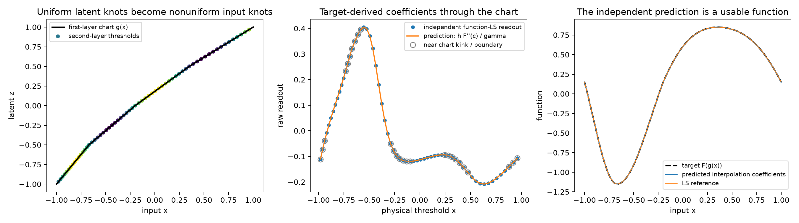
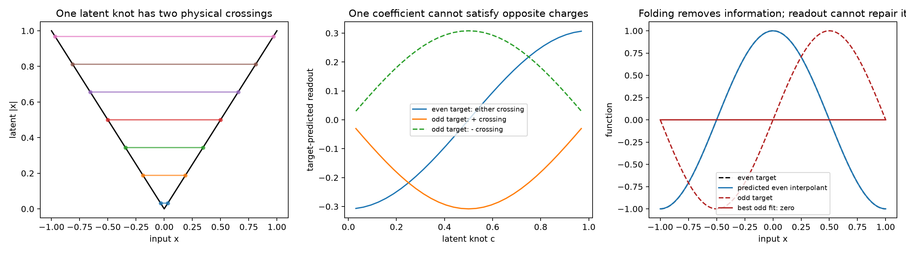
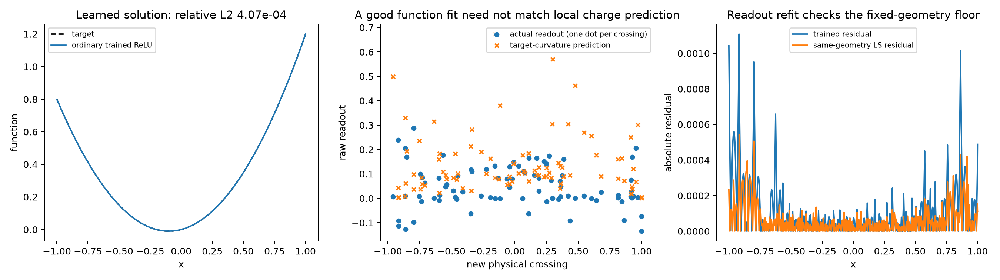
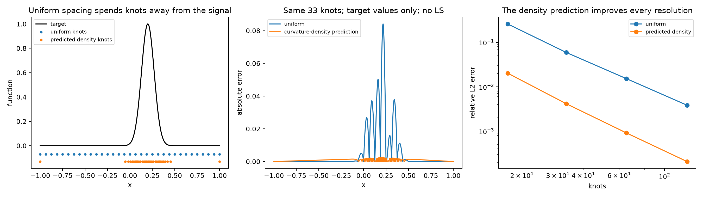

# What a learned geometry can encode, and what it cannot

Codex theory and controlled checks, September 30, 2026.

The useful unification is **approximation on a learned quotient of the input space, using an adaptive family of features**. “Quotient” has a concrete meaning: inputs sent to the same representation become indistinguishable to every subsequent readout. A good representation preserves the distinctions the task needs and expresses those distinctions in coordinates that a small, stable approximation family can use.

QI is an unusually transparent instance: the representation is a known coordinate, the features form a translated family, and their coefficients are explicit measurements of a target derivative. Deep networks can change both that coordinate and the approximation family. Their readouts need not remain samples of the original input derivative. Below we derive the corrected derivative, a direct coefficient predictor, and an obstruction that predicts exactly when no such readout can work.

This is a set of exact results and tested restricted predictions, not a theorem that arbitrary deep networks learn this construction. Sections 4.3–4.4 use constructed two-layer geometries; Section 4.5 tests independently trained ordinary ReLU networks and finds an important failure of the simple coefficient interpretation. The accompanying campaign also tests tanh networks and learned manifold compression.

## 1. The objects, their spaces, and an exact error decomposition

Let the input be a random vector \(X\in\mathcal X\subseteq\mathbb R^D\), with probability measure \(\mu\). The noiseless scalar target is \(f:\mathcal X\to\mathbb R\), with \(\mathbb E[f(X)^2]<\infty\). A learned representation is a measurable map

\[
g:\mathcal X\longrightarrow\mathcal Z\subseteq\mathbb R^d,
\qquad Z=g(X).
\]

The distribution of \(Z\) is the pushforward measure \(\nu=g_\#\mu\): for a measurable set \(B\subseteq\mathcal Z\), \(\nu(B)=\mu(g^{-1}(B))\). This measure matters: making a coordinate change does not make the fitting distribution uniform.

The final nonlinear features are scalar functions \(\phi_j:\mathcal Z\to\mathbb R\). Include independently fitted baselines among them. Their synthesis map is

\[
A:\mathbb R^m\to L^2(\nu),\qquad Av=\sum_{j=1}^m v_j\phi_j.
\]

The attainable latent functions form the finite-dimensional subspace \(V=\operatorname{ran}(A)\subset L^2(\nu)\). A network with frozen geometry computes \(q(g(x))\), where \(q=Av\in V\).

Define the conditional target \(\eta(z)=\mathbb E[f(X)\mid Z=z]\), as an element of \(L^2(\nu)\). Let \(P_V:L^2(\nu)\to V\) be orthogonal projection. Every \(q\in V\) satisfies

\[
\boxed{
\mathbb E[(f(X)-q(Z))^2]
=\mathbb E[\operatorname{Var}(f(X)\mid Z)]
+\|\eta-P_V\eta\|_{L^2(\nu)}^2
+\|P_V\eta-q\|_{L^2(\nu)}^2.
}
\tag{1}
\]

The three terms are information discarded by the representation, approximation error of its features, and readout error relative to the best population fit in those features.

**Proof with the intermediate steps.** Write

\[
f(X)-q(Z)=[f(X)-\eta(Z)]+[\eta(Z)-P_V\eta(Z)]+[P_V\eta(Z)-q(Z)].
\]

For every square-integrable function \(h(Z)\), the first bracket obeys

\[
\mathbb E[(f(X)-\eta(Z))h(Z)]
=\mathbb E[\mathbb E[f(X)-\eta(Z)\mid Z]h(Z)]=0.
\]

The second bracket is orthogonal to every function in \(V\), while the third lies in \(V\). All cross terms therefore vanish on expanding the square. The first squared norm is the expectation of the conditional variance by its definition. This proves (1).

This is a population identity. A sample LS solve estimates the second and third terms; finite-sample generalization is not automatically zero. For noisy observations \(Y=f(X)+\epsilon\), with \(\mathbb E[\epsilon\mid X]=0\), add \(\mathbb E[\epsilon^2]\) to (1).

Consequences that can be tested:

* A low-dimensional representation can fit one target perfectly while failing to preserve the input manifold. The extreme example is \(g(x)=f(x)\), with readout \(q(z)=z\). Its success says nothing about reconstructing \(x\) or fitting an unrelated target.
* Once two inputs with different target values have been identified by \(g\), placing more kernels or solving readouts more accurately cannot repair the first term.
* When representation error is small, readout refitting can still leave a substantial feature approximation floor. Conversely, an excellent feature span can coexist with poorly optimized readouts.

In log-loss classification, the corresponding exact distinction is conditional label uncertainty plus a KL divergence to the predicted conditional distribution. Squared-error orthogonality should not be asserted unchanged for every loss. The general common object is the conditional prediction problem after a representation, not specifically an L2 projector.

## 2. How a deeper layer places ridges on the represented data

For this section, let \(g:\mathcal X\to\mathbb R^d\) be differentiable, let \(a\in\mathbb R^d\) be a unit direction, and let \(c\in\mathbb R\), \(\gamma>0\). A subsequent neuron is

\[
\phi(x)=\sigma\bigl(\gamma[a^Tg(x)-c]\bigr).
\]

Its transition set is \(\{x:a^Tg(x)=c\}\): the inverse image of a latent hyperplane. Write \(J_g(x)\in\mathbb R^{d\times D}\) for the Jacobian of \(g\). The preactivation gradient is

\[
\nabla_x\{\gamma[a^Tg(x)-c]\}=\gamma J_g(x)^Ta.
\]

If this vector is nonzero, the inverse transition width in its input-normal direction is locally proportional to

\[
\gamma_{\rm effective}(x)=\gamma\|J_g(x)^Ta\|.
\tag{2}
\]

The proportionality convention depends on how an activation width is defined, but the Jacobian factor is exact. A small raw gamma does not imply a broad input-space feature. A single latent hyperplane can intersect a curved representation many times, tying multiple distant pieces of the input function to one coefficient.

For piecewise-linear networks this becomes exact spline geometry: the first layer partitions the input into cells, each later preactivation is affine within each cell, and its zero set cuts those cells. This matches the established [max-affine spline description of deep networks](https://proceedings.mlr.press/v80/balestriero18b.html). It does not show that SGD places those cuts uniformly, or that every feature behaves like one local bump on the input.

Merely observing a one-dimensional curve of hidden activations from a one-dimensional input is not evidence of learned manifold discovery: any smooth network maps an input curve to a curve, possibly with folds or collapsed pieces. Useful measurements are injectivity, tangent distortion, threshold coverage, target transfer, and approximation error after freezing the representation.

## 3. The derivative changes when the network changes coordinates

Suppose temporarily that the input and latent coordinate are scalar and \(g\) is strictly increasing with \(g'(x)>0\). Let

\[
F(z)=f(g^{-1}(z)),\qquad z\in g([a,b]).
\]

Then \(f(x)=F(g(x))\). The operator differentiating a physical-input function with respect to the latent coordinate is

\[
\mathcal D_g=\frac{1}{g'(x)}\frac{d}{dx}.
\]

In particular,

\[
F'(g(x))=\frac{f'(x)}{g'(x)},
\qquad
F''(g(x))=\frac{f''(x)}{g'(x)^2}-\frac{f'(x)g''(x)}{g'(x)^3}.
\tag{3}
\]

To obtain the second formula, differentiate \(f'/g'\) with respect to \(x\), obtaining \(f''/g'-f'g''/g'^2\), then divide once more by \(g'\). Higher orders follow by repeated application of \(\mathcal D_g\); they are not simply \(f^{(r)}/g'^r\).

For uniform latent tanh centers \(c_j\) with spacing \(h\), ordinary raw-tanh QI predicts

\[
v_j\approx\frac h2F'(c_j)
=\frac{h}{2g'(x_j)}f'(x_j),\qquad x_j=g^{-1}(c_j).
\tag{4}
\]

Physical spacing is locally \(\Delta x_j\approx h/g'(x_j)\), and the effective gamma is \(\gamma g'(x_j)\). Thus

\[
v_j\approx\frac{\Delta x_j}{2}f'(x_j),
\qquad \gamma_{{\rm effective},j}\Delta x_j\approx\gamma h.
\]

This predicts a relationship between spacing, width, and readout before fitting the new target. Its assumptions are important: a useful monotone chart, a uniform latent family, a resolved smooth target, and suitable boundary/halo treatment. It is not a universal normalization that makes arbitrary learned branches collapse onto \(f'\).

For ReLU, the corresponding property is latent curvature \(F''\), with the additional correction in (3). An ordinary derivative in one coordinate is not an invariant scalar under a nonlinear coordinate change. This is exactly where differential geometry becomes useful: the chart and its derivative operator must be part of the interpretation.

## 4. A new direct ReLU coefficient predictor, with measured checks

### 4.1 Exact interpolation coefficients from target samples

Let \(z_0<\cdots<z_N\) be latent knots. Let \(F_j=F(z_j)\) be target values, and define secant slopes

\[
s_j=\frac{F_{j+1}-F_j}{z_{j+1}-z_j},\qquad 0\le j<N.
\]

The continuous piecewise-linear interpolant has the exact representation

\[
I_F(z)=F_0+s_0(z-z_0)+\sum_{j=1}^{N-1}(s_j-s_{j-1})(z-z_j)_+.
\tag{5}
\]

Here \((u)_+=\max(u,0)\). Its value at \(z_0\) is \(F_0\). Its slope in interval \((z_k,z_{k+1})\) is the telescoping sum \(s_0+\sum_{j=1}^k(s_j-s_{j-1})=s_k\). Therefore it reaches every prescribed knot value and is the interpolant. No fitting matrix or inverse is involved.

For raw features \(\operatorname{ReLU}(\gamma_j(z-z_j))\), positive homogeneity gives

\[
\operatorname{ReLU}(\gamma_j(z-z_j))=\gamma_j(z-z_j)_+,
\qquad
\boxed{v_j=\frac{s_j-s_{j-1}}{\gamma_j}.}
\tag{6}
\]

This is an activation-specific correction to the original gamma intuition: **positive gamma is not a ReLU width**. It is exactly interchangeable with readout scaling. The invariant curvature charge is \(\alpha_j=\gamma_jv_j\). By contrast, changing gamma really changes the shape of a tanh or smooth GELU feature.

For a smooth target and nearby left/right spacings \(h_-\), \(h_+\), Taylor expansion gives

\[
s_j=F'(z_j)+\frac{h_+}{2}F''(z_j)+O(h_+^2),\quad
s_{j-1}=F'(z_j)-\frac{h_-}{2}F''(z_j)+O(h_-^2).
\]

Consequently,

\[
\alpha_j\approx\frac{h_-+h_+}{2}F''(z_j).
\tag{7}
\]

This explains why the scaled readout follows curvature on a nonuniform mesh, and what scaling it needs. It predicts coefficients from the target, rather than differentiating the fitted network and plotting the result.

### 4.2 Function least squares has a more accurate interior curvature rule

Interpolation and L2 fitting are different. On an infinite uniform grid with spacing \(h\), let \(T_j\) be the peak-one hat of support \([z_j-h,z_j+h]\), and let \(u_j\) be the nodal values of the L2 projection. Integrating two overlapping hats gives

\[
\langle T_j,T_j\rangle=2h/3,\qquad
\langle T_j,T_{j\pm1}\rangle=h/6,
\]

with every other overlap zero. Thus

\[
\frac h6(u_{j-1}+4u_j+u_{j+1})=\langle F,T_j\rangle.
\tag{8}
\]

For a sinusoidal mode \(F(z)=e^{i\omega z}\), the right-hand side is

\[
h\operatorname{sinc}(\omega h/2)^2 e^{i\omega z_j},
\qquad \operatorname{sinc}(t)=\sin(t)/t.
\]

Substitute \(u_j=Ue^{i\omega z_j}\) in (8). Since \(e^{-it}+e^{it}=2\cos t\), it gives

\[
U=\frac{\operatorname{sinc}(\omega h/2)^2}{(2+\cos(\omega h))/3}.
\]

The ReLU curvature charge is the change of adjacent spline slopes:

\[
\alpha_j=\frac{u_{j+1}-2u_j+u_{j-1}}h
=hF''(z_j)\,
\frac{\operatorname{sinc}(\omega h/2)^4}{(2+\cos(\omega h))/3}.
\tag{9}
\]

The multiplier equals \(1-(\omega h)^4/720+O((\omega h)^6)\). Therefore the leading L2 prediction is \(\alpha_j=hF''(z_j)\); its relative mode error begins at fourth order, rather than the second-order error of ordinary interpolation coefficients. One cancellation explains this improvement: the nodal L2 correction is \(-h^2F''/12\), whose contribution to the slope jump cancels the \(+h^3F^{(4)}/12\) interpolation term.

Infinite sinusoids are understood here through the translation-invariant normal equations or a periodic analogue; they are not L2 functions on the whole line. Finite boundaries and nonuniform fitting densities add corrections. The checks below deliberately include a nonconstant density induced by a chart, so (9) is not falsely presented as exact for their full finite geometry.

### 4.3 Controlled two-hidden-layer check

The first layer represents a monotone piecewise-linear chart with physical knots

\[
x=(-1,-0.67,-0.2,0.35,1),\qquad g(x)=(-1,-0.5,0,0.5,1).
\]

Such a chart is exactly an affine function plus ReLU slope jumps. The second layer places uniform latent ReLU knots, with positive scales \(\gamma_j=1.5+0.65\sin(7c_j+0.3)\). An always-active ReLU and output bias supply the affine latent baseline. The target is

\[
f(x)=F(g(x)),\qquad F(z)=\sin(\pi z)+0.15\cos(2\pi z).
\]

The direct prediction uses \(v_j=hF''(c_j)/\gamma_j\). The reference independently solves ordinary function LS in the original input measure \(dx\). We use 16-point Gaussian quadrature on every common latent cell, with the Jacobian weight \(dx/dz\); prediction formulas do not use that solve. Function errors use 16,385 independent uniformly spaced input evaluations.

| Latent nodes | Nonlinear curvature coefficients | Relative coefficient error, all coefficients | Relative error away from boundaries/chart kinks | Function-LS relative L2 | Direct target-sample interpolant relative L2 |
|---:|---:|---:|---:|---:|---:|
| 17 | 15 | 0.004674 | no eligible interior points | 0.006648 | 0.01573 |
| 33 | 31 | 0.001600 | 0.0001053 (4 coefficients) | 0.001626 | 0.003948 |
| 65 | 63 | 0.0005841 | 0.00001426 (36 coefficients) | 0.0004043 | 0.0009881 |
| 129 | 127 | 0.0002120 | 0.000004300 (100 coefficients) | 0.0001009 | 0.0002471 |

The interior subset is defined geometrically, before looking at coefficient errors: latent distance greater than \(3.01h\) from chart kinks or either endpoint. These are relative errors, not percentages: for 65 nodes the all-coefficient error is **0.0584%**, and the interior error is **0.00143%**. The spectral correction in (9) barely changes those interior numbers; chart-density and boundary corrections dominate at the tested resolution. We do not claim fourth-order convergence for this finite, piecewise-density experiment.

### 4.4 Folding produces an exact obstruction

Take the first-layer representation \(g(x)=|x|=(x)_++(-x)_+\). A second-layer feature \((|x|-c)_+\), for \(c>0\), has a slope jump of \(+1\) at both \(-c\) and \(+c\). Therefore one coefficient produces equal curvature charges at those two locations.

For an even target, such as \(\cos(\pi x)\), the target charges agree. For an odd target, such as \(\sin(\pi x)\), they have opposite signs. A single coefficient cannot satisfy both. More fundamentally, every function of \(|x|\) is even. Under a symmetric input measure, every even function is orthogonal to the odd target. Thus the best possible predictor through this representation is zero, with relative L2 error exactly one. This conclusion holds for every readout width, not only the chosen finite dictionary.

With 33 latent nodes, the even target's direct interpolant has relative L2 error **0.0008796**, and function LS reaches **0.0003597**. For the odd target, independent LS returns relative error **1.000000** and a maximum absolute prediction of **5.47e−16**. The geometry predicts the success and failure before solving.

The practical diagnostic extends to arbitrary frozen deep ReLU features on a scalar input. Enumerate all their breakpoints \(t_l\), and define the slope-jump matrix \(B\in\mathbb R^{L\times m}\), with \(B_{lj}\) the slope jump of feature \(j\) at \(t_l\). Every feature is an affine term plus its hinge expansion, so network curvature charges satisfy \(\alpha=Bv\). At a new breakpoint belonging only to neuron \(j\), an independent target-interpolation charge predicts \(v_j=\alpha_l^{\rm target}/B_{lj}\). If that neuron has several such crossings, those independently computed ratios must agree. Disagreement falsifies the simple per-neuron local-curvature interpretation for that geometry; it does not become a successful interpretation merely because the synthesized network derivative can be plotted.

### 4.5 A trained ReLU control rejects the universal local-curvature reading

We also trained ordinary two-hidden-layer ReLU networks of width 256 on \(f(x)=x^2+0.2x\), with two seeds. Protocol: Xavier-uniform weights; all biases initially uniform on \([-0.2,0.2]\); 1,025 fixed uniform training points; float64; full-batch Adam, learning rate 0.001, 12,000 steps; then PyTorch LBFGS with strong-Wolfe search, at most 1,500 iterations, gradient tolerance \(10^{-12}\), change tolerance \(10^{-15}\), history size 50. No QI geometry was supplied. A 16,385-point uniform evaluation grid supplies dense curves and a separate readout fit, cutoff \(10^{-12}\), for the same-geometry floor. That grid includes the training points and is not an independent held-out set. We additionally evaluate both saved learned and refitted readouts at 4,096 independently scrambled Sobol points, seeds 17000 and 17001, with zero training-point overlap. No retraining or refitting uses those held-out points.

The diagnostic enumerates first-layer breakpoints, solves each affine second-layer preactivation for its zeros within those intervals, and thereby finds every new second-layer crossing. This computation is analytic in the frozen weights; it does not estimate derivatives by differencing noisy network outputs. At each new crossing the relevant feature slope jump is \(|z_j'|\). The independent target charge at each union-grid knot is especially simple here: since \(f''=2\), it is exactly \(h_-+h_+\). Thus numerical differentiation of the target is unnecessary, even for near-colliding knots.

For a neuron with several new crossings, we combine their proposed charges using the geometry-only scalar rule \(v_j^{\rm pred}=\sum_l B_{lj}\alpha_l^{\rm target}/\sum_l B_{lj}^2\), summing only its new crossings. This does not fit function values against the network features.

| Quantity | Seed 0 | Seed 1 |
|---|---:|---:|
| Independent Sobol relative L2, learned network | 0.0004066 | 0.0003227 |
| Independent Sobol relative L2, refitted readout | 0.0002075 | 0.0001626 |
| Dense-grid relative L2, learned network | 0.0004071 | 0.0003229 |
| Dense-grid same-geometry readout floor | 0.0002077 | 0.0001627 |
| First-layer knots in the input interval | 96 | 104 |
| New second-layer crossings | 86 | 83 |
| Neurons with at least one new crossing | 67 | 67 |
| Neurons with multiple new crossings | 19 | 16 |
| Relative error predicting those raw learned readouts | 1.456 | 1.612 |
| Relative error predicting those refitted readouts | 0.9994 | 0.8514 |
| New crossings with the target's positive curvature sign | 75.6% | 55.4% |

The 189 second-layer neurons per model without new crossings are not included in this coefficient test. They can be inactive, affine on the full input interval, or contribute at shared first-layer knots; the unique-new-crossing formula does not isolate them. Likewise, shared old knots must be analyzed through the full slope-jump matrix rather than assigning them to one second-layer neuron.

The output errors are small, about 0.03–0.04%, but the independent readout predictions fail by 146–161%. Even though the target is strictly convex, the learned networks have many negative curvature events. Nearby positive/negative events can have little effect on function values, especially at almost-colliding knots (minimum gaps about \(1.4\times10^{-7}\)). Function L2 accuracy therefore does not force microscopic target-curvature agreement. Refitting improves the function and still fails the local coefficient interpretation, so this is not explained solely by an unoptimized readout.

The proposed target charges are those of the local nodal interpolant, not a derived formula for this irregular dictionary's best L2 readout. L2 fitting need not preserve those charges even when solved exactly. The failed comparison therefore rejects the strong local-interpolation interpretation of learned weights; it does not refute the general projection theory or rule out a more complicated geometry-dependent encoder. The constructed chart experiment above separately tests the leading L2 curvature prediction where its assumptions approximately hold.

This is a concrete correction to the universal version of the hypothesis. In controlled QI-like charts, normalized readouts accurately predict local target curvature. In ordinary learned geometry, a good function fit can instead use compensating fine structure. A useful general interpretation has to retain that compensation, choose an explicit coarse resolution, or make a canonical representation; it cannot assert every raw readout is already a local sample of target curvature.

For transparency, width-32 and width-128 pilots on \(\sin(\pi x)+0.2\cos(3\pi x)\) reached only 2.7–3.8% and 0.22–0.27% relative errors respectively. Their coefficient predictions also failed, but they are not used as evidence about highly accurate fits. All pilot metrics are retained. The final quadratic target was chosen to obtain a clearer traditional-training positive control with an exact independent target-curvature formula, rather than spending an unlimited budget chasing high-precision ReLU fits to oscillatory functions.

## 5. Uniformity is useful only in the right measure

Uniformity is a robust reference for translation-invariant target classes. It is not generally the most efficient placement for one known target. The distinction can be quantified without another neural-network fit.

Consider linear interpolation on a small interval of length \(h\), and suppose \(f''\) and input density \(p\) vary slowly there. For a quadratic, interpolation error is exactly \(f''(x-a)(x-b)/2\). Hence

\[
\int_a^b p(x)|f(x)-I_f(x)|^2dx
\approx\frac{p f''^2}{4}\int_0^h t^2(h-t)^2dt
=\frac{p f''^2h^5}{120}.
\tag{10}
\]

Let \(\rho(x)>0\) be a normalized asymptotic knot density, \(\int\rho=1\), and let there be approximately \(N\rho(x)dx\) intervals in a small region of width \(dx\). Their length is \(h\approx1/(N\rho(x))\). Summing (10) gives

\[
E^2\approx\frac1{120N^4}\int p(x)f''(x)^2\rho(x)^{-4}dx.
\]

Introduce a multiplier \(\lambda\) for \(\int\rho=1\). The first variation in \(\rho\) is

\[
-4p(x)f''(x)^2\rho(x)^{-5}+\lambda=0,
\]

so the asymptotic optimal density is

\[
\boxed{\rho(x)\propto[p(x)|f''(x)|^2]^{1/5}.}
\tag{11}
\]

This is a derived interpolation result, not a universal optimal-density formula for every activation or loss. It says that uniformity should be assessed against approximation difficulty. A uniform-grid construction can be near-optimal for a uniformly difficult target class while wasting knots on one localized target.

For \(f(x)=\exp[-100(x-0.2)^2]\) on \([-1,1]\), uniform input measure, the following test uses only target-sample interpolation. Adaptive nodes are quantiles of \(|f''|^{2/5}+10^{-4}\); the small positive floor avoids numerical zero-density intervals.

| Nodes | Uniform relative L2 | Predicted-density relative L2 | Improvement |
|---:|---:|---:|---:|
| 17 | 0.2604 | 0.02031 | 12.82× |
| 33 | 0.05921 | 0.004147 | 14.28× |
| 65 | 0.01528 | 0.0009160 | 16.68× |
| 129 | 0.003850 | 0.0002074 | 18.57× |

This corrects the strong version of the uniform-placement hypothesis. The actionable question is whether a learned geometry has coverage defects relative to its target and fitting measure, or useful adaptive concentration. Uniformizing the latter can make it worse.

## 6. What is invariant, and what a raw coefficient cannot identify

For independent features, let \(\phi(z)\in\mathbb R^m\) collect feature values and \(G=\mathbb E_\nu[\phi(Z)\phi(Z)^T]\in\mathbb R^{m\times m}\) be their population overlap matrix. Replacing features by \(\widetilde\phi=T\phi\), with invertible \(T\), preserves the output span, while readouts change to \(\widetilde v=T^{-T}v\). The Gram matrix becomes \(TGT^T\). Therefore neither raw coefficient magnitudes nor ordinary Gram eigenvalues are intrinsic properties of the function space without a specified coefficient normalization.

The projection kernel

\[
K_V(z,z')=\phi(z)^TG^{-1}\phi(z')
\]

is invariant under this change: substituting \(\widetilde\phi\) and \((TGT^T)^{-1}=T^{-T}G^{-1}T^{-1}\) cancels both copies of \(T\). This is one useful invariant of the output subspace and fitting measure. It is established projection theory, not a new algorithm or an explanation of how the subspace was learned.

A coefficient norm or regularizer adds real structure. The kernel \(\phi(z)^T\phi(z')\), ordinary gradient descent on coefficients, and an L2 coefficient penalty change under a general rescaling of features. They describe a particular parameter metric, not just the attainable output space. In a ReLU network even positive diagonal feature rescaling is an exact realizable network symmetry; it can change hidden PCA variance ratios arbitrarily while preserving the function after the next layer compensates. A PCA plot needs normalization and task-transfer controls.

If duplicate features occur, \((v_1,v_2)\) can change to \((v_1+t,v_2-t)\) without altering the function. In near-dependent smooth dictionaries the same is approximately true to a specified accuracy. Therefore no method can recover unique derivative-valued raw readouts from the target alone without stating a coefficient convention and a resolution. Individual readouts may be uninterpretable even when invariant combinations, curvature charges, or canonical Radon coefficients are clear.

This does not erase the positive result. Equations (6)–(9) identify when raw coefficients, after a known normalization, really are target curvature measurements. The theory predicts both identifiable and nonidentifiable cases. A general learned dictionary requires testing those conditions, not declaring every coefficient plot a disguised derivative.

## 7. Function geometry and information geometry do meet, with a precise scope

Assume observations have a specified Gaussian model

\[
Y\mid X=x\sim\mathcal N(F_\theta(x),s^2),
\]

where \(\theta\in\mathbb R^p\) is the full parameter vector and \(s^2>0\) is fixed. The log-likelihood score is

\[
\nabla_\theta\log p_\theta(Y\mid x)
=\frac{Y-F_\theta(x)}{s^2}\nabla_\theta F_\theta(x).
\]

Its expected outer product, the Fisher information, is

\[
\mathcal I(\theta)
=\frac1{s^2}\mathbb E_\mu[\nabla_\theta F_\theta(X)\nabla_\theta F_\theta(X)^T].
\tag{12}
\]

The equality uses \(\mathbb E[(Y-F_\theta(x))^2\mid x]=s^2\). For frozen features and readout parameters, this is exactly \(G/s^2\). Thus the same overlap that redistributes readouts also measures statistical distinguishability of coefficient changes under this observation model. The relationship is standard [natural-gradient and Gauss–Newton geometry](https://jmlr.org/papers/v21/17-678.html), with the likelihood assumptions stated rather than inferred from metaphor.

A joint differential makes the proposed “cross object” concrete. Vary both input \(x\) and parameters \(\theta\). The Gaussian model assigns the local quadratic form

\[
\frac1{s^2}(dF)^2
=\frac1{s^2}\left[\nabla_xF\cdot dx+\nabla_\theta F\cdot d\theta\right]^2.
\tag{13}
\]

It contains an input block, a parameter block, and their cross terms. This is an exact pullback of the output-distribution Fisher metric. It is generally singular. In particular, one scalar mean has input rank at most one, so this metric cannot identify an arbitrary three-dimensional data manifold. Multiple independent outputs, a reconstruction distribution, or other retained information are required to recover the other directions. This is a concrete correction to treating prediction geometry as automatically the entire input geometry.

For a small parameter corruption at an exact fit, let the sampled prediction Jacobian be \(J\in\mathbb R^{n\times p}\). Perturbing parameter \(j\) by \(\delta\) gives residual \(r=\delta J_{:,j}+O(\delta^2)\). Squared-error gradient is therefore

\[
\nabla_\theta L=J^Tr=\delta J^TJ_{:,j}+O(\delta^2).
\]

Every overlapping parameter receives a gradient. This occurs in convex linear readout fitting, so it is not evidence by itself of a bad local basin. It explains why a geometry-aware joint correction can undo a corruption more directly than many coordinate steps. It does not prove every second-order method will be practical or every gradient method is wrong.

## 8. How this extends to Radon, activations, and deeper models

Higher-dimensional ridge constructions replace local scalar curvature by an orientation-indexed transform of the target. A Radon profile integrates the target over hyperplanes; inversion filters those profiles before summing ridges. In 3D, with a specific Fourier/Radon normalization and an average over all directions, the filtered profile is \(q_v(t)=-\partial_t^2 Rf(v,t)/(2\pi)\). A normalized step or tanh discretization of each profile consequently encodes its first derivative, hence a filtered third derivative of the Radon transform. The independent Radon component of this campaign supplies the conventions, construction, and numerical tests; raw joint-LS coefficients need not equal that canonical construction because the directional family is redundant on the fitted domain. The [variational Radon-spline literature](https://arxiv.org/abs/2105.03361) formalizes related function spaces under explicit regularization; it does not prove arbitrary Adam coefficients choose a canonical Radon gauge.

The model suggests a modular explanation for architecture robustness. Different activations and architectures can provide different usable feature families on representations retaining the needed information. Equal behavior does not require equal raw weights or one common derivative order. What must survive are information, approximation capacity in the target's relevant directions, and a workable parameter metric. The exact decomposition (1) tells us which failure has occurred; the QI and ReLU calculations make particular approximation families predictive.

This also predicts some actual failures. A folded representation fails a target that varies across its fibers. A purely affine network cannot fit a nonlinear target. A fixed-depth polynomial-activation network has bounded polynomial degree and cannot approximate every target arbitrarily accurately at that fixed depth. Saturated, duplicated, or poorly covered features can lose required directions. A kernel spectral notch is fatal only for target directions that cannot be recovered elsewhere in the geometry; moving scales and directions can evade a notch that looked bad in a frozen uniform test. These statements are stronger and more falsifiable than classifying an activation as globally “best” or “worst” from one Gram matrix.

A learned representation followed by a constructive local approximation is already present in [Chui–Mhaskar's manifold-coordinate construction](https://www.frontiersin.org/journals/applied-mathematics-and-statistics/articles/10.3389/fams.2018.00012/full). The deep-feature/linear-readout distinction is also central to the [adaptive-basis training viewpoint](https://proceedings.mlr.press/v107/cyr20a.html). Conversely, [neural regression collapse](https://arxiv.org/abs/2409.04180) provides evidence and a restricted regularized model in which penultimate features become target-dimensional rather than preserving all input geometry. These precedents support the framework's components without establishing a universal account of learned manifolds.

## 9. What is established and what the campaign must not claim

The preceding work adds three concrete predictions to the earlier projection/perturbation checkpoint:

1. **A coordinate change changes the derivative that the readout measures.** Equations (3)–(4) include the missing Jacobian and curvature corrections. The deep ReLU experiment directly predicts independent solved coefficients at sub-percent error without a new target fit.
2. **A single neuron can tie multiple curvature events together.** The folded example predicts a successful even target and an impossible odd target exactly. Counting neurons or inspecting latent dimension alone misses this obstruction.
3. **Uniformity must match approximation difficulty.** A calculus-of-variations density gives a 12.8–18.6× interpolation improvement over uniform nodes for the tested localized target. Uniformizing learned geometry is an intervention to test, not a theorem of improvement.

The previous checkpoint gives exact fixed-geometry duals and finite-edit response formulas. Those remain correct and useful. This extension explains how a deep representation changes the target property those formulas should act on, and supplies conditions under which local readouts are interpretable or necessarily coupled.

The ambitious general statement still needing evidence is that ordinary well-trained networks usually discover coordinates and feature families close to such interpretable constructions. The controlled successes do not establish it, and the new ordinary-ReLU test rejects its strongest microscopic version: accurate learned outputs need not have directly interpretable local-curvature readouts. Any more general account must specify which compensating combinations or coarse-resolution features it predicts. A derivative reconstructed from the learned coefficients is not an independent test of that account.

Reproduce the constructed tests with `experiments/expI04_codex_geometry_unification/theory_relu_checks.py`, and the learned control with `theory_learned_relu.py --width 256 --target quadratic --steps 12000` in the same experiment directory. Numerical outputs, saved learned parameters, and standalone figures are in the adjacent `theory/` directory. No hidden derivative solve or target-dependent SVD enters the coefficient predictors; LS is used only as a separately reported reference.
